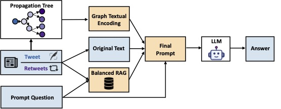

<div align=center>
<h1>Network-informed Prompt Engineering against Organized Astroturf Campaigns under Extreme Class Imbalance</h1>


 [](https://arxiv.org/abs/2501.11849)
 [](https://hits.seeyoufarm.com)

<div>
      <b>Nikos Kanakaris</b>,
      <b>Heng Ping</b>,
      <b>Xiongye Xiao</b>,
      <b>Nesreen K. Ahmed</b>,
      <b>Luca Luceri</b>,
      <b>Emilio Ferrara</b>,
      <b>Paul Bogdan</b>,
</div>
</div>

<br>
<div>

Check out our paper at https://arxiv.org/abs/2501.11849.

To appear in the <a href="https://www2025.thewebconf.org/">WWW'25 Companion Proceedings</a> (<a href="https://beyondfacts2025.wordpress.com/">BeyondFacts'25</a>)

</div>
<br>
 <div>
We propose a novel framework for identifying astroturf campaigns based solely on large language models (LLMs), introducing a Balanced Retrieval-Augmented Generation (Balanced RAG) component. Our approach first gives both textual information concerning the posts and the user interactions of the social network as input to a language model. Then, through prompt engineering and the proposed Balanced RAG method, it effectively detects coordinated disinformation campaigns on X (Twitter). The proposed framework does not require any training or fine-tuning of the language model. Instead, by strategically harnessing the strengths of prompt engineering and Balanced RAG, it facilitates LLMs to overcome the effects of class imbalance and effectively identify coordinated political campaigns. The experimental results demonstrate that by incorporating the proposed prompt engineering and Balanced RAG methods, our framework outperforms the traditional graph-based baselines, achieving 2x-3x improvements in terms of precision, recall and F1 scores.
</div>




# Quick start to reproduce the evaluation results

## -1. Before you even begin - Make sure everything is up and running
1. [Install Python 3.11](https://www.python.org/)
2. [Install Ollama](https://ollama.com/).
    * You might also need to download some models locally. Check here if you encounter any related issue while running the code: https://github.com/ollama/ollama?tab=readme-ov-file#model-library.

## 0. Read the paper and get a glimpse, study the experiments and the ablation study. It really hepls!
Link: https://arxiv.org/abs/2501.11849

## 1. Install dependencies and setup environment
```bash
python3.11 -m virtualenv env 
source env/bin/activate
```

```bash
pip install -r requirements.txt
```

## 2. Download the dataset
1. **Due to privacy policy restrictions, the utilized dataset cannot be published online. Feel free to reach out and we'd be happy to send the dataset over <kanakari at usc.edu, nikos.kanakaris89 at gmail.com>.**
2. Simply extract the zip file with the dataset under the main directory of this project.

## 3.1. To get the results of Table 2 'Llama 70B + Balanced RAG' - Experiments with the Balanced RAG technique and 6-shot
```bash
python prompt_rag_few_shots_contrastive_metrics.py
```

## 3.2. To get the results of Table 2 'Llama 70B (6-shot)' - Experiments with random 6-shot without RAG 
```bash
python prompt_few_shots_metrics.py
```


## 3.3. To get the results of Table 3 - Impact of the temperature value
```bash
python prompt_rag_temperature.py
```

## 3.4. To get the results of Figure 2 - Impact of the size of the LLM model

```bash
python prompt_rag_model_size.py
```

## 3.5. To get the results of Table 4 - Impact of the number of prompting examples

```bash
python prompt_rag_temperature.py
```

## 3.6. To get the evaluation metrics of the output results
```bash
python result_metrics.py
```


## Reference

For reference please cite the following:

```bibtex
@misc{astrorag,
      title={Network-informed Prompt Engineering against Organized Astroturf Campaigns under Extreme Class Imbalance}, 
      author={Nikos Kanakaris and Heng Ping and Xiongye Xiao and Nesreen K. Ahmed and Luca Luceri and Emilio Ferrara and Paul Bogdan},
      year={2025},
      eprint={2501.11849},
      archivePrefix={arXiv},
      primaryClass={cs.CL},
      url={https://arxiv.org/abs/2501.11849}, 
}
```